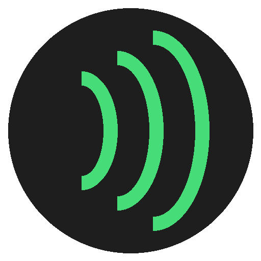
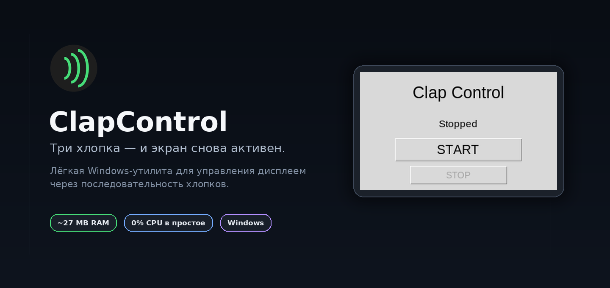
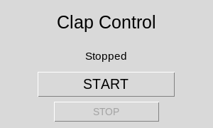
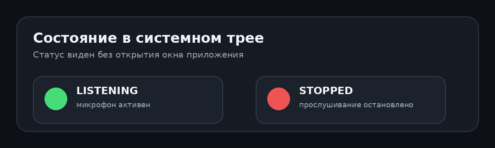
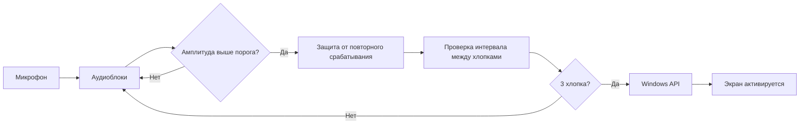
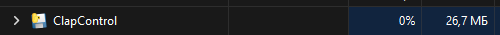

<p align="center">
  
</p>

<h1 align="center">ClapControl</h1>

<p align="center">
  <b>Три хлопка — и экран снова активен.</b><br>
  Лёгкая Windows-утилита, которая слушает микрофон в фоне,<br>
  распознаёт последовательность хлопков и возвращает погасший дисплей к жизни.
</p>

<p align="center">
  
  
  
  
  
</p>

<p align="center">
  
</p>

---

## Что это

**ClapControl** — небольшое Windows-приложение для управления дисплеем через звук.

Когда Windows продолжает работать, но экран уже погас по таймеру, приложение остаётся в фоне и анализирует входящий звук с микрофона. Если зафиксированы **3 хлопка с допустимым интервалом**, ClapControl вызывает системную функцию Windows и активирует дисплей.

Никакой сети, облака, аккаунта или постоянной записи аудио на диск.

> ClapControl не выводит ноутбук из настоящего Sleep / Hibernate и не запускает выключенный компьютер. Текущая версия работает, пока Windows продолжает выполнять программу.

---

## Как это выглядит

<p align="center">
  
</p>

Интерфейс намеренно минимальный:

| Элемент | Что делает |
|---|---|
| `START` | Запускает прослушивание микрофона и сворачивает приложение в системный трей |
| `STOP` | Останавливает обработку звука |
| `Listening` | Детектор активен |
| `Stopped` | Детектор остановлен |

После запуска основное окно не обязано оставаться открытым — рабочее состояние видно по значку рядом с часами.

<p align="center">
  
</p>

**Зелёный** — микрофон слушается.  
**Красный** — обработка остановлена.

---

## Как это работает



В текущей версии используется простой детектор амплитуды. Это осознанное решение: минимум зависимостей, предсказуемая работа и низкая нагрузка вместо тяжёлой обработки аудио.

### Параметры детектора

```python
BLOCK_SIZE = 1024      # Размер анализируемого аудиоблока
THRESHOLD = 0.25       # Минимальная амплитуда потенциального хлопка
COOLDOWN = 0.3         # Защита от нескольких срабатываний на один хлопок
CLAPS_NEEDED = 3       # Количество хлопков в команде
MAX_INTERVAL = 1.0     # Максимальный интервал между соседними хлопками
```

`THRESHOLD` зависит от микрофона и его чувствительности. Значение `0.25` — рабочая настройка текущей конфигурации, а не универсальная константа для любого устройства.

---

## Что происходит после третьего хлопка

ClapControl вызывает Windows API:

```python
ctypes.windll.kernel32.SetThreadExecutionState(0x00000002)
```

`0x00000002` — флаг `ES_DISPLAY_REQUIRED`. Он сообщает Windows, что дисплей снова требуется, и сбрасывает таймер его отключения.

Это не эмуляция мыши и не искусственное движение курсора — приложение обращается к системному механизму управления питанием дисплея.

---

## Ресурсы

На текущей сборке приложение показало следующий результат в Windows Task Manager:

<p align="center">
  
</p>

| Ресурс | Наблюдаемое значение |
|---|---:|
| CPU в простое | `0%` |
| RAM | `26.7 MB` |
| GPU | практически не используется |
| Сеть | не используется |
| Запись аудио на диск | отсутствует |

Значения могут немного отличаться между системами и версиями Python.

---

## Стек

| Компонент | Роль |
|---|---|
| **Python** | основная логика приложения |
| **Tkinter** | минимальный GUI |
| **sounddevice** | чтение аудио с микрофона |
| **NumPy** | быстрый анализ амплитуды |
| **pystray** | системный трей |
| **Pillow** | работа с изображениями и иконкой |
| **ctypes / Windows API** | активация дисплея |
| **PyInstaller** | сборка Windows-приложения |

---

## Запуск из исходников

### 1. Получить проект

Склонируйте репозиторий через кнопку **Code** на GitHub или скачайте ZIP.

### 2. Создать окружение

```bash
python -m venv .venv
```

Активировать в Windows:

```bash
.venv\Scripts\activate
```

### 3. Установить зависимости

```bash
python -m pip install -r requirements.txt
```

### 4. Запустить

```bash
python main.py
```

После запуска нажмите `START`. Приложение свернётся в системный трей и начнёт анализировать звук с микрофона.

---

## Сборка `.exe`

Установить PyInstaller:

```bash
python -m pip install pyinstaller
```

Собрать приложение:

```bash
python -m PyInstaller --clean --onedir --windowed --name ClapControl --icon=clap_control.ico main.py
```

Готовая сборка появится здесь:

```text
dist/
└── ClapControl/
    ├── ClapControl.exe
    └── _internal/
```

Используется режим `--onedir`: он проще для диагностики, быстрее стартует и не требует распаковки всего приложения во временную директорию при каждом запуске.

---

## Структура проекта

```text
ClapControl/
├── main.py
├── requirements.txt
├── clap_control.ico
├── ClapControl.spec
├── README.md
├── .gitignore
└── docs/
    └── assets/
        ├── logo.png
        ├── hero.png
        ├── app-window.png
        ├── tray-status.png
        └── performance.png
```

`build/`, `dist/`, `.venv/` и файлы IDE в репозиторий не добавляются.

---

## Ограничения v1.0

- Windows должна продолжать работать; настоящий Sleep / Hibernate останавливает обычный Python-процесс.
- Детектор ориентируется прежде всего на амплитуду, поэтому некоторые резкие звуки теоретически могут быть приняты за хлопок.
- Порог чувствительности пока фиксированный.
- Используется активный микрофон Windows по умолчанию.
- Для пробуждения полностью спящего или выключенного ноутбука потребуется отдельный аппаратный механизм.

---

## Приватность

ClapControl работает локально.

- аудио не отправляется в интернет;
- сетевые запросы не выполняются;
- аудиозаписи не создаются;
- анализируются только короткие блоки звука в оперативной памяти;
- после `STOP` поток микрофона закрывается.

---

## Возможные следующие версии

- [ ] выбор микрофона из интерфейса;
- [ ] настраиваемые количество хлопков и интервалы;
- [ ] автоматическая калибровка порога;
- [ ] более точное отделение хлопка от речи и других резких звуков;
- [ ] опциональный автозапуск вместе с Windows;
- [ ] аппаратная версия для настоящего Wake из Sleep.

Текущая версия намеренно остаётся небольшой: одна конкретная задача, минимальный интерфейс и низкая фоновая нагрузка.

---

<p align="center">
  <b>ClapControl v1.0</b><br>
  Небольшой проект, построенный от первого аудиопрототипа до самостоятельного Windows-приложения.
</p>
